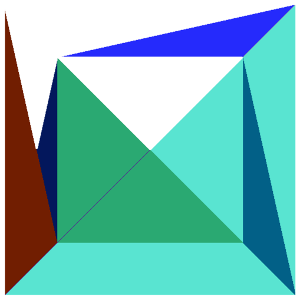

<h1 align="center">
<br/>software_rasterizer
</h1>

**Let your CPU cosplay as a GPU 💅!**

This was a simple hobby project made on the side with what I learned from resources online. It uses the CPU
to perform the rasterization process, the magical process of turning 3D stuffs to be viewable on your 2D screen.

Currently, this rasterizer only has a builtin parser for loading Wavefront Object files, but you can definitely
pipe your own.

## Building

This project uses a very simple [Makefile](./Makefile).

By default it compiles without an address sanitizer (because I am on Windows and the GCC MingW64 installation I have
does not have a native ASAN port and I am too lazy):

```bash
make re
```

Outputs a final executable in the root directory and other compiled objects are located in [`/obj`](./obj/)

> Running `make` also works, but it can be problematic for not cleaning up old compilation stuffs

If you have and can link with an address sanitizer build it with the `asan` target:

```bash
make asan
```

## Resources

1. [UT Austin CS354](https://www.cs.utexas.edu/~theshark/courses/cs354/lectures.html)
2. [Paul Bourke Object Files](https://paulbourke.net/dataformats/obj/)
3. [Cornell CS4620 View Explorer](https://www.cs.cornell.edu/courses/cs4620/2019fa/demos/view_explore/view_explore_ortho.html)
4. [UAlberta ~ BMP File Format](https://www.ece.ualberta.ca/~elliott/ee552/studentAppNotes/2003_w/misc/bmp_file_format/bmp_file_format.htm)
5. [The Base Mesh](https://www.thebasemesh.com/model-library)